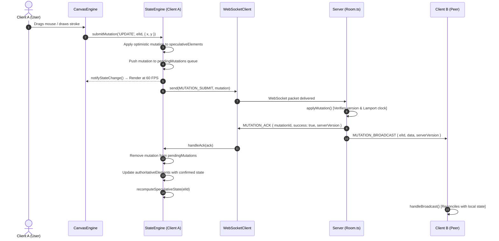

# Inkwell Architecture

---

## Table of Contents

1. [Executive Summary & Core Philosophy](#1-executive-summary--core-philosophy)
2. [The Fundamental Problem of Real-Time Collaboration](#2-the-fundamental-problem-of-real-time-collaboration)
3. [Multiplayer Engine: Client-Side Prediction & Reconciliation](#3-multiplayer-engine-client-side-prediction--reconciliation)
   - [The Dual-World Architecture](#the-dual-world-architecture)
   - [The Complete Mutation Lifecycle](#the-complete-mutation-lifecycle)
   - [Monotonic Clocks & Lamport Timestamps](#monotonic-clocks--lamport-timestamps)
   - [Deterministic Conflict Resolution](#deterministic-conflict-resolution)
   - [The Rollback and Replay Algorithm](#the-rollback-and-replay-algorithm)
   - [Multiplayer Undo / Redo](#multiplayer-undo--redo)
4. [WebSocket Networking & Protocol Architecture](#4-websocket-networking--protocol-architecture)
   - [Protocol Framing & Actions](#protocol-framing--actions)
   - [Remote Presence & Cursor Interpolation (LERP)](#remote-presence--cursor-interpolation-lerp)
   - [Server-Side Room Lifecycle & Persistence](#server-side-room-lifecycle--persistence)
   - [Network Chaos Simulation](#network-chaos-simulation)
5. [High-Performance Canvas 2D Graphics Engine](#5-high-performance-canvas-2d-graphics-engine)
   - [The Dirty-Flag Render Loop](#the-dirty-flag-render-loop)
   - [Coordinate Systems: Screen Space vs. World Space](#coordinate-systems-screen-space-vs-world-space)
   - [Multi-Layer Offscreen Compositing](#multi-layer-offscreen-compositing)
   - [The Eraser Architecture (`destination-out`)](#the-eraser-architecture-destination-out)
   - [Spatial Math & Hit Testing](#spatial-math--hit-testing)
6. [UI Architecture & Zero-Framework Lifecycle](#6-ui-architecture--zero-framework-lifecycle)
   - [The `render()` + `attachEvents()` Contract](#the-render--attachevents-contract)
   - [CSS Architecture & Design Tokens](#css-architecture--design-tokens)
7. [Key Skills & Career Takeaways](#7-key-skills--career-takeaways)

---

## 1. Executive Summary & Core Philosophy

**Inkwell** is a collaborative vector and drawing studio inspired by Figma's multiplayer architecture. It is built from scratch in vanilla **TypeScript**, running on raw **WebSockets** and the native **HTML5 Canvas 2D Context**. It relies on zero heavy runtime frameworks—no React, no Tailwind, no Socket.io, no Operational Transformation (OT) libraries, and no CRDT frameworks (like Yjs or Automerge).

Most basic canvas tutorials just fire WebSocket events and fall apart the second two people drag the same rectangle. I wanted to see if I could implement the client-side prediction and reconciliation loop from Figma's original tech blog.

### How It Works

If you wait for the server before rendering local mouse drags, the UI feels terrible. If you mutate the canvas blindly, state drifts immediately.

To handle this, the client keeps two copies of the document tree:

- Server state: The last confirmed snapshot from the backend.

- Working state: Your local modifications drawn optimistically at 60fps.

When the server sends an update from another user, the client rolls back to the last confirmed server tick, applies the incoming changes, and replays your pending local actions on top. If two people modify the same property at the same time, last-write-wins decides the winner.

### Stack

- **TypeScript** -- everything, client and server
- **Vite** -- dev server and production bundler
- **WebSocket** (`ws`) -- raw WebSocket server, no socket.io
- **Node.js** -- server runtime
- **Canvas 2D API** -- rendering, no WebGL, no libraries
- **`tsx`** -- runs the TypeScript server directly without a compile step

Keeping everything in vanilla TypeScript and raw WebSockets made it a lot easier to trace state bugs and step through the byte payloads in the network tab without framework overhead getting in the way.

### Why Build Without Frameworks?

1. **Mechanical Sympathy**: Frameworks introduce virtual DOM diffing overhead, garbage collection spikes, and abstraction layers that obscure the actual cost of network packets, memory allocations, and redraw cycles.
2. **Deep Understanding**: Implementing client-side prediction, Lamport clocks, offscreen canvas compositing, and vector math from first principles teaches you *how* systems like Figma, Miro, and multiplayer game engines actually function under the hood.
3. **Traceability**: In a multi-client distributed system, bugs frequently involve network race conditions, monotonic clock desynchronization, and pixel-compositing order. Having raw TypeScript and explicit byte/JSON payloads makes it trivial to step through every single state transition in the debugger.

---

## 2. The Fundamental Problem of Real-Time Collaboration

Most beginner canvas tutorials implement multiplayer using naive broadcast:

```
[User A drags circle] ──> [Send { x, y } via WS] ──> [Server broadcasts] ──> [User B renders { x, y }]
```

### Why Naive Broadcast Fails in Production:

1. **Network Latency**: If User A waits for the server round-trip (~50–200ms) before moving the circle on their screen, the app feels laggy and unresponsive.
2. **Uncontrolled Concurrent Edits**: If User A and User B drag the same rectangle in opposite directions at the same millisecond:
   - User A sees their own move first, then gets User B's move.
   - User B sees their own move first, then gets User A's move.
   - **Both clients end up at different coordinates**, permanently desynchronized!
3. **Ghost Deletions**: If User A edits an element while User B deletes it, what happens? Naive systems crash or resurrect deleted elements.

To solve this, professional systems use **Client-Side Prediction with Centralized Reconciliation** (popularized by multiplayer game engines and Figma's engineering architecture).

---

## 3. Multiplayer Engine: Client-Side Prediction & Reconciliation

The heart of Inkwell's synchronization is implemented in [`src/engine/StateEngine.ts`](./src/engine/StateEngine.ts) on the client and [`server/Room.ts`](./server/Room.ts) on the server.

### The Dual-World Architecture

Every client maintains **two independent copies** of the document tree in memory:

```
┌─────────────────────────────────────────────────────────────┐
│                       Client StateEngine                    │
│                                                             │
│   1. Authoritative State (authoritativeElements: Map)       │
│      ├── Pure truth confirmed by the server                │
│      └── Never contains unacknowledged speculative changes  │
│                                                             │
│   2. Speculative State (speculativeElements: Map)           │
│      ├── What the user actually sees on screen at 60 FPS    │
│      └── Optimistic local edits applied immediately         │
│                                                             │
│   3. Pending Queue (pendingMutations: Mutation[])           │
│      └── Ordered list of local actions waiting for server ACK│
└─────────────────────────────────────────────────────────────┘
```

When you render the canvas, [`CanvasEngine.ts`](./src/canvas/CanvasEngine.ts) **always reads from `speculativeElements`**. This ensures $0\text{ms}$ local latency.

---

### The Complete Mutation Lifecycle

Here is the exact step-by-step sequence when a user creates, updates, or deletes an element:



---

### Monotonic Clocks & Lamport Timestamps

Every mutation and element in Inkwell tracks three distinct counters:

1. **`roomVersion: number`**: A global monotonically increasing integer incremented by the server every time any mutation succeeds in the room.
2. **`version: number`**: A per-element monotonic sequence counter. An element starts at `version = 1`. Each valid update increments it (`version = 2, 3, ...`).
3. **`lamportClock: number`**: A logical distributed clock that captures causality:
   - When a client generates a mutation: `localClock++`
   - When the server receives it: `serverClock = Math.max(serverClock, incomingClock) + 1`
   - When a peer receives a broadcast: `peerClock = Math.max(peerClock, broadcastClock) + 1`

Because physical computer clocks drift (due to NTP sync differences, time zones, or client clock skew), **physical timestamps cannot be trusted to order events**. Lamport logical clocks ensure that if event $A$ caused event $B$, $A$ will always have a lower clock value than $B$.

---

### Deterministic Conflict Resolution

When two clients submit edits for the same element at the same time, the server in [`server/Room.ts`](./server/Room.ts#L233-L254) resolves the conflict deterministically using a multi-tier tie-breaking algorithm:

```ts
// Check if client edit is clean (based on current confirmed version)
const isClean = mutation.baseVersion === existing.version;
let shouldApply = isClean;

if (!isClean) {
  // Concurrent edit detected! Compare Lamport clocks:
  if (mutation.lamportClock > existing.lamportClock) {
    shouldApply = true;
  } else if (mutation.lamportClock === existing.lamportClock) {
    // Clocks tied: compare physical client timestamps
    if (mutation.clientTimestamp > existing.updatedAt) {
      shouldApply = true;
    } else if (mutation.clientTimestamp === existing.updatedAt) {
      // Deterministic lexical tie-breaker (alphabetical authorId)
      shouldApply = mutation.authorId > existing.authorId;
    } else {
      shouldApply = false;
    }
  } else {
    shouldApply = false;
  }
}
```

#### Why This Guarantees Eventual Consistency:
Even if packets arrive out of order, or two users click at the exact microsecond, **every client and server reaches the exact same conclusion** without asking any client to confirm.

---

### The Rollback and Replay Algorithm

What happens if Client A's mutation is rejected or superseded by an incoming edit from Client B?

In [`src/engine/StateEngine.ts`](./src/engine/StateEngine.ts#L478-L505), Inkwell executes `recomputeSpeculativeState()`:

```ts
private recomputeSpeculativeState(elementId: string): void {
  const auth = this.authoritativeElements.get(elementId);
  if (!auth) {
    // Element was deleted on the server: delete locally
    this.speculativeElements.delete(elementId);
    return;
  }

  // 1. Roll back to pristine authoritative server state
  let spec: CanvasElement = { ...auth };

  // 2. Replay all unacknowledged pending mutations on top
  for (const pending of this.pendingMutations) {
    if (pending.elementId === elementId) {
      if (pending.type === 'UPDATE') {
        spec = {
          ...spec,
          ...pending.data,
          version: spec.version + 1
        };
      } else if (pending.type === 'DELETE') {
        this.speculativeElements.delete(elementId);
        return;
      }
    }
  }

  // 3. Commit the reconciled state to working view
  this.speculativeElements.set(elementId, spec);
}
```

This guarantees:
- If your change won, it stays.
- If your change lost, your local screen seamlessly rolls back to the server winner.
- If you have further pending typing or mouse drags queued up, they re-apply on top of the newly accepted server baseline.

---

### Multiplayer Undo / Redo

In single-player apps, "Undo" simply restores the previous snapshot of the canvas. 

In a multiplayer app, **restoring a global snapshot would erase everyone else's work!**

#### The Selective Inverse Mutation Strategy:
Inkwell uses an operation-based history stack in [`src/engine/StateEngine.ts`](./src/engine/StateEngine.ts#L243-L280):

- When you perform an action, an entry is pushed to `undoStack` containing `{ type, elementId, before, after }`.
- When you press `Ctrl+Z`, Inkwell **inverts only your action**:
  - Inverse of `CREATE` $\rightarrow$ Submit `DELETE` mutation for that element.
  - Inverse of `DELETE` $\rightarrow$ Submit `CREATE` mutation restoring the saved `before` state.
  - Inverse of `UPDATE` $\rightarrow$ Submit `UPDATE` mutation restoring only the fields you changed.
- The inverse operation is sent through the normal mutation pipeline, verified by the server, and broadcast to all peers. Other users' shapes on the canvas remain completely untouched.

---

## 4. WebSocket Networking & Protocol Architecture

### Protocol Framing & Actions

Inkwell connects to a single WebSocket endpoint (`/ws`). Every message conforms to the canonical JSON packet structure defined in [`src/types.ts`](./src/types.ts):

```ts
interface ProtocolMessage<T = unknown> {
  action: ProtocolAction;
  payload: T;
  timestamp: number;
}
```

#### Core Protocol Catalog:
| Action | Direction | Purpose |
|---|---|---|
| `JOIN_ROOM` | Client $\rightarrow$ Server | Initial handshake with `roomId`, `clientName`, `clientColor`, and optional password. |
| `SYNC_STATE` | Server $\rightarrow$ Client | Full snapshot of all elements, layers, and active peer presences upon room entry. |
| `MUTATION_SUBMIT` | Client $\rightarrow$ Server | Outgoing optimistic mutation proposal. |
| `MUTATION_ACK` | Server $\rightarrow$ Client | Server confirmation or rejection with updated monotonic room version. |
| `MUTATION_BROADCAST` | Server $\rightarrow$ Peers | Real-time broadcast of accepted mutations to all peers in the room. |
| `PRESENCE_UPDATE` | Client $\rightarrow$ Server | Lightweight cursor coordinates, active tool, and selection ids. |
| `PRESENCE_BROADCAST` | Server $\rightarrow$ Peers | Cursor and selection updates relayed to other participants. |
| `HEARTBEAT_PING / PONG` | Both | Continuous round-trip latency measurement displayed in the UI. |

---

### Remote Presence & Cursor Interpolation (LERP)

Transmitting mouse positions at 60 FPS from 10 users would flood the network with 600 packets per second, causing congestion and packet buffer bloat.

#### 1. Throttled Broadcasting:
In [`src/engine/StateEngine.ts`](./src/engine/StateEngine.ts), local cursor broadcasts are throttled to **25ms (40Hz)**.

#### 2. Linear Interpolation (LERP) in Canvas:
If remote cursors were rendered only when packets arrived, they would stutter across the screen. 
In [`src/canvas/CanvasEngine.ts`](./src/canvas/CanvasEngine.ts#L1040-L1070), incoming positions are saved as `targetX, targetY`. Every animation frame, the rendered position smoothly glides toward the target using LERP:

$$\text{currentPos} = \text{currentPos} + (\text{targetPos} - \text{currentPos}) \times 0.35$$

This produces silky, buttery 60 FPS cursor motion from low-frequency network updates.

---

### Server-Side Room Lifecycle & Persistence

The server in [`server/server.ts`](./server/server.ts) and [`server/Room.ts`](./server/Room.ts) manages rooms with zero external database dependencies:

1. **In-Memory Operations**: Active rooms live in a `Map<string, Room>()`. Reading, writing, and broadcasting take $O(1)$ time in memory.
2. **Debounced Disk Snapshots**: When mutations occur, a flush timer is scheduled with a **1200ms debounce**. If 50 mutations arrive during a rapid drawing stroke, only **one disk write** occurs to `data/rooms/<roomId>.json`.
3. **Automatic Cleanup & Hydration**: When the server restarts, rooms are lazily restored from disk the moment the first user connects. When all users leave a room, memory state remains cleanly serialized on disk.

---

### Network Chaos Simulation

To prove that the reconciliation engine actually works under terrible network conditions, Inkwell includes a built-in **Chaos Console** ([`src/ui/ChaosConsole.ts`](./src/ui/ChaosConsole.ts)):

In [`src/engine/WebSocketClient.ts`](./src/engine/WebSocketClient.ts#L95-L125), all incoming and outgoing messages pass through an artificial network interceptor:
- **Artificial Latency**: Delays packets by 0–2000ms.
- **Jitter**: Randomizes packet arrival order.
- **Packet Drop Rate**: Randomly drops a percentage of packets to simulate subway tunnels or unstable Wi-Fi.

Because of the optimistic rollback/replay system, users can draw with 500ms latency without noticing any local lag.

---

## 5. High-Performance Canvas 2D Graphics Engine

### The Dirty-Flag Render Loop

A common pitfall in canvas development is running an unconstrained `requestAnimationFrame` loop that clears and redraws all elements 60 times a second, even when nothing is moving:

```ts
// BAD: Burns 100% CPU on mobile battery
function loop() {
  ctx.clearRect(0, 0, width, height);
  drawEverything();
  requestAnimationFrame(loop);
}
```

#### The Inkwell `isDirty` Pattern:
In [`src/canvas/CanvasEngine.ts`](./src/canvas/CanvasEngine.ts#L220-L245):
- The animation loop checks `if (!this.isDirty) return;`
- CPU and GPU usage drops to **0.0%** when the canvas is idle.
- `requestRender()` sets `isDirty = true` only when an element moves, a brush stroke extends, or a remote cursor moves.

---

### Coordinate Systems: Screen Space vs. World Space

When zooming and panning, mouse coordinates on the screen do not match the $(x, y)$ coordinates in the drawing world:

- **Screen Space**: Pixels relative to the top-left of the `<canvas>` viewport element.
- **World Space**: Infinite canvas coordinates where elements actually live.

```
Screen Space (Mouse click: 400, 300)
       ↓
Translate: (screen - camera.offset)
       ↓
Scale: divide by camera.zoom
       ↓
World Space (Element position: 1250, -420)
```

In [`src/canvas/CanvasEngine.ts`](./src/canvas/CanvasEngine.ts#L480-L500):
```ts
public screenToWorld(screenX: number, screenY: number): Point {
  return {
    x: (screenX - this.camera.x) / this.camera.zoom,
    y: (screenY - this.camera.y) / this.camera.zoom
  };
}

public worldToScreen(worldX: number, worldY: number): Point {
  return {
    x: worldX * this.camera.zoom + this.camera.x,
    y: worldY * this.camera.zoom + this.camera.y
  };
}
```
At the start of every frame, `ctx.setTransform(dpr, 0, 0, dpr, 0, 0)` sets the display scale, followed by `ctx.translate(camera.x, camera.y)` and `ctx.scale(camera.zoom, camera.zoom)`. All rendering functions can then draw directly in world coordinates.

---

### Multi-Layer Offscreen Compositing

Inkwell supports Photoshop-style layers (Base, Artwork, Overlays). 

To render layers cleanly, `CanvasEngine` uses **double-buffering** with two offscreen canvases:
1. `layerCanvas`: Renders all elements belonging to a specific layer.
2. `elementCanvas`: Composites visible layers in ascending order (`layer.order`).
3. Main Viewport Context: Draws `elementCanvas` to the screen and renders transient selection handles and cursors on top.

---

### The Eraser Architecture (`destination-out`)

In basic drawing apps, "erasing" is just drawing with a white pen. This fails completely if the canvas has a dark theme, a grid pattern, or multiple overlapping layers.

#### How Inkwell Implements True Vector Erasing:
In [`src/canvas/CanvasEngine.ts`](./src/canvas/CanvasEngine.ts#L780-L815):
1. Normal elements on a layer are drawn with `ctx.globalCompositeOperation = 'source-over'`.
2. Eraser strokes (which are stored with `brushType: 'eraser'`) are drawn on the layer using:
   ```ts
   ctx.globalCompositeOperation = 'destination-out';
   ```
3. `destination-out` turns existing pixels transparent wherever the eraser stroke passes!
4. Because this compositing occurs on the offscreen `elementCanvas` *before* the background grid is drawn, **eraser strokes punch transparent holes through artwork without damaging the background grid or canvas paper texture**.

---

### Spatial Math & Hit Testing

When clicking or area-selecting with a marquee, Inkwell must determine which element was touched:

- **Boxes & Rectangles**: Standard Axis-Aligned Bounding Box (AABB) intersection math:
  $$\text{hit} = (x \ge el.x) \land (x \le el.x + el.w) \land (y \ge el.y) \land (y \le el.y + el.h)$$
- **Freehand Pen Strokes**: An array of hundreds of points. Inkwell computes the perpendicular distance from the click point $P$ to every line segment $AB$ of the stroke:
  $$\text{dist}(P, AB) \le \frac{\text{strokeWidth}}{2} + \text{threshold}$$
  If the distance is within threshold, the stroke is selected.
- **Eraser Elements Exclusion**: Eraser strokes are explicitly excluded from `hitTest()` so users cannot accidentally select or move an eraser hole.

---

## 6. UI Architecture & Zero-Framework Lifecycle

### The `render()` + `attachEvents()` Contract

All UI components in `src/ui/` ([`StudioHeader.ts`](./src/ui/StudioHeader.ts), [`StudioFooter.ts`](./src/ui/StudioFooter.ts), [`ToolRail.ts`](./src/ui/ToolRail.ts), [`PropertyBar.ts`](./src/ui/PropertyBar.ts), [`LobbyModal.ts`](./src/ui/LobbyModal.ts)) adhere to a strict lifecycle:

```ts
export class Component {
  constructor(container: HTMLElement, engine: StateEngine) {
    this.container = container;
    this.render();
    this.subscribe();
  }

  public render(): void {
    // 1. Rebuild HTML string
    this.container.innerHTML = `...`;
    
    // 2. CRITICAL: Re-attach DOM event listeners
    this.attachEvents();
  }

  private attachEvents(): void {
    this.container.querySelector('#btn')?.addEventListener('click', ...);
  }
}
```

> **The `innerHTML` Gotcha**: Setting `innerHTML` wipes out all existing child DOM nodes and removes their attached event listeners. Any component that re-renders via `innerHTML` **must always re-bind its listeners inside `attachEvents()`**. Element references should never be cached across renders.

---

### CSS Architecture & Design Tokens

All styles are unified in [`public/styles/main.css`](./public/styles/main.css) using strict CSS custom properties defined in `:root`:

```css
:root {
  --color-brand: #EA580C;
  --bg-surface: #FFFFFF;
  --bg-card: #F8FAFC;
  --text-primary: #0F172A;
  --text-muted: #64748B;
  --border-outer: #E2E8F0;
  --border-inner: #F1F5F9;
  --font-sans: 'Plus Jakarta Sans', system-ui, sans-serif;
  --font-mono: 'JetBrains Mono', monospace;
}

[data-theme="dark"] {
  --bg-surface: #0F172A;
  --bg-card: #1E293B;
  --text-primary: #F8FAFC;
  --border-outer: #334155;
}
```

Theme switching is instant: changing `document.documentElement.setAttribute('data-theme', 'dark')` updates every CSS variable in the document tree in a single composite frame.

---

## 7. Key Skills & Career Takeaways

Building Inkwell exercises several advanced software engineering competencies:

### 1. Distributed Systems & Concurrency
- **Optimistic UI with Reconciliation**: Mastered the dual-state pattern (authoritative vs. speculative) used by Figma, Google Docs, and multiplayer game engines.
- **Lamport Logical Clocks**: Learned why physical wall-clock timestamps fail in distributed systems and how logical clocks establish strict causal ordering.
- **Deterministic Conflict Resolution**: Built a conflict engine where every peer independently calculates the identical final state without central consensus locking.

### 2. Low-Level Web & Canvas Graphics
- **Frame Budget Management**: Keeping `requestAnimationFrame` render loops idle via dirty flags ($0\%$ CPU when inactive).
- **Coordinate Matrix Arithmetic**: Transforming between Screen Space and infinite World Space with zoom and pan matrices.
- **Compositing Modes**: Utilizing offscreen canvases and `globalCompositeOperation = 'destination-out'` to implement clean vector erasing.

### 3. Full-Stack Production Architecture
- **Raw WebSockets Protocol**: Designed an efficient, typed binary/JSON protocol without third-party framework overhead.
- **HTTP Caching Semantics**: Understanding the critical difference between content-hashed immutable assets and unhashed cache-revalidated assets in production deployments.
- **Touch & Mobile Ergonomics**: Implementing responsive layouts that adapt from ultra-wide multi-monitor desktops down to 360px mobile viewports with multi-touch gestures.

---

